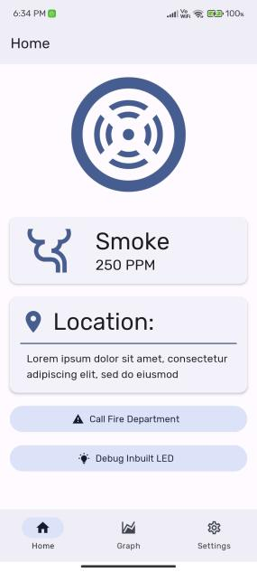
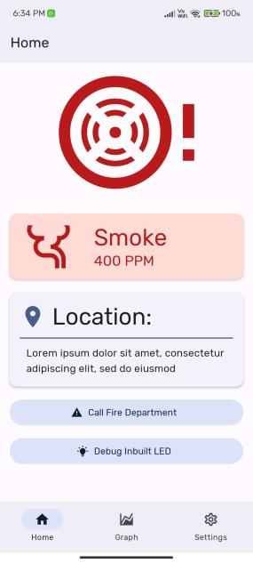
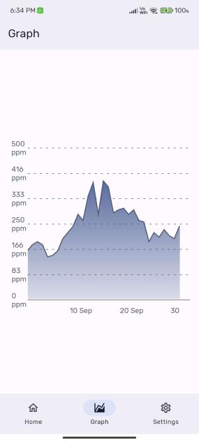
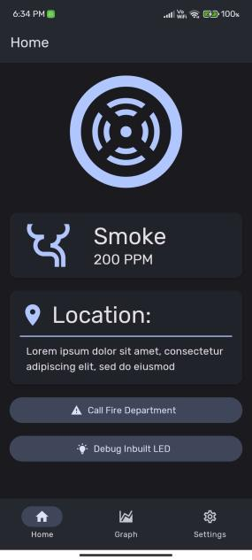
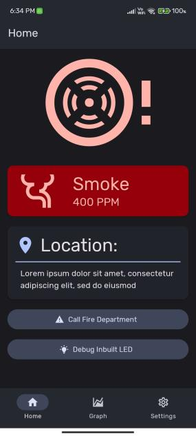
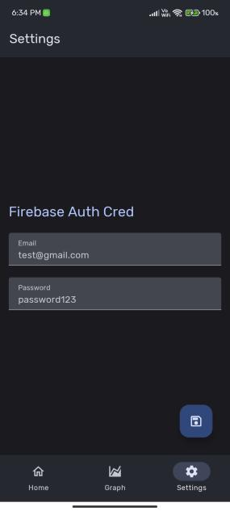

<h2>
	SmokeWatch App: Real-time Smoke Detection (SEM7-IIoT-Project)
</h2>

Frontend for the SmokeWatch Project. This project is a part of the SEM5-EIoT-Project and SEM7-IIoT-Project. The project is a real-time smoke detection system that uses:
- NodeMCU V3 ESP8266
- MQ2 Smoke Sensor
- GPS Module
  
The project is built using React Native (Expo) and Firebase for the backend.

## Screenshots
<div style="display:flex; gap:1em;">
	
	
	
	
</div>

<div style="display:flex; gap:1em; margin-top:1em;">
	
	
	
	
</div>
    
## Run Locally
1. Install NPM packages
```bash
npm install
```
2. Install Android Platform Tools 
3. Connect your Android device to your computer (Install Android Studio with an emulator if you don't have an Android device) 
4. Get your device id using
```bash
adb devices
```
5. Start reverse tunneling (-s argument is optional if multiple devices are connected to the computer)
```bash
adb -s <device_id> reverse tcp:8081 tcp:8081
```
6. Build and run the app
```bash
npx expo run:android -d <device_id>
```

### Other way to run the app
```
npx expo start
```
> Note: If the app shows failed to connect then use the following flag
```
npx expo start --tunnel
```

## Misc
- Clearing build cache
```bash
npx expo start --clear
```

> If your gradle build fails due to your system having different jdk versions then use the following command
```bash
export JAVA_HOME=/path/to/jdk
```
